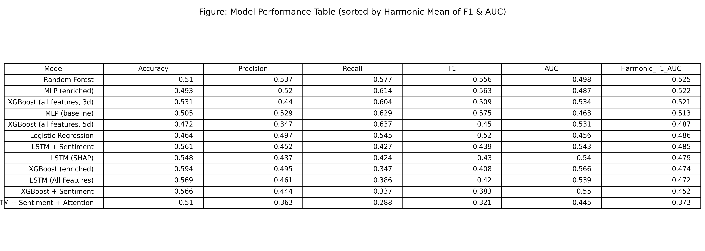
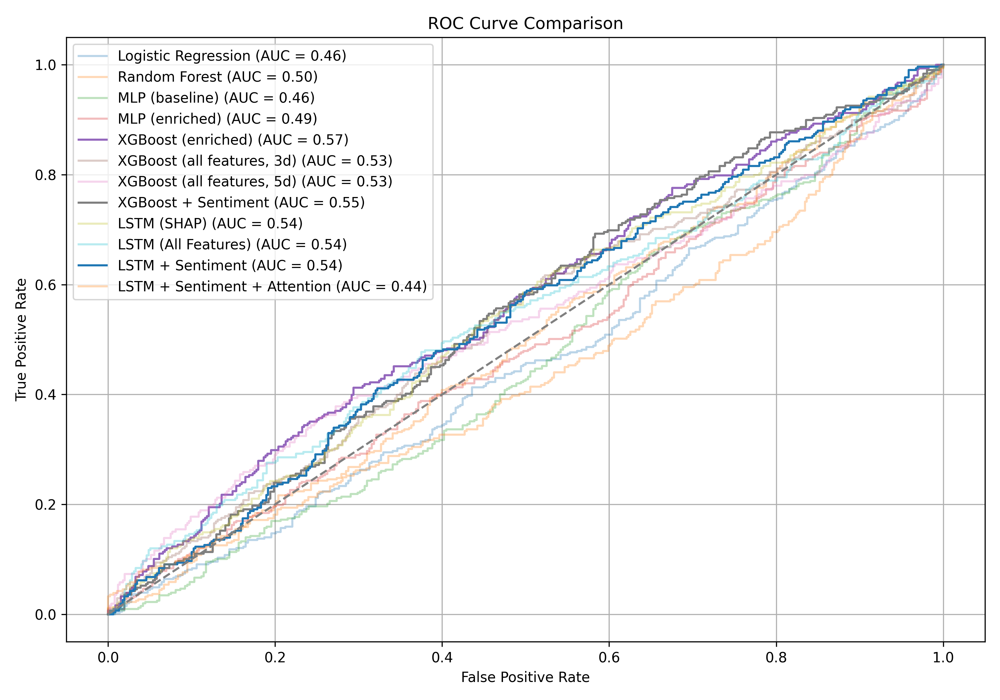

# Apple Stock Forecast

## 1. Project Overview

This project looks at whether the short-term direction of Apple Inc. (AAPL) stock can be predicted using a mix of historical price data and sentiment from financial news.

The dataset includes daily stock prices and technical indicators like moving averages, volatility, and momentum. Sentiment scores were added based on news headlines about Apple, and all features were aligned by date.

To keep the models simple and focused, a SHAP-based feature selection method was used. Several models were tested, including Logistic Regression, Random Forest, MLP, XGBoost, and LSTM. Sentiment was included in later stages to see if it helps improve prediction.**

<b><u>The goal is to compare different types of models and understand which features, especially sentiment, are useful for forecasting stock trends.</u></b>


## 2. Project Structure

```text
.
├── data/
│   ├── apple_stock_data.csv
│   ├── apple_stock_data_enriched.csv
│   ├── apple_news_data.csv
│   └── news/
│
├── figures/
│   ├── eda/
│   ├── feature_engineering/
│   ├── feature_enrichement/
│   └── feature_selection/
│
├── models/
│   └── (trained model weights)
│
├── results/
│   └── (CSV files with predictions, metrics, probabilities)
│
├── scripts/
│   ├── Load_data.py
│   ├── EDA/
│   ├── Feature_engineering.py
│   ├── feature_enrichement/
│   ├── Feature_selection.py
│   ├── create_sentiment_enriched_data.py
│   ├── Modeling_baselines.py
│   ├── Modeling_mlp.py
│   ├── Modeling_xgboost.py
│   ├── Modeling_xgboost_all_features.py
│   ├── Modeling_xgboost_sentiment.py
│   ├── Modeling_lstm.py
│   ├── Modeling_lstm_all.py
│   ├── Modeling_sentiment_lstm.py
│   ├── Modeling_lstm_sentiment_attention.py
│   └── Final_comparison.py
│
├── run_full_pipeline.py
├── README.md
├── requirements.txt

```

## 3. How to Run

Make sure you have Python 3.8+ and all dependencies installed.

## 4. Data Requirements

This project uses financial news data for Apple Inc. from the following Kaggle dataset:

[Apple Stock Financial News Dataset on Kaggle](https://www.kaggle.com/datasets/frankossai/apple-stock-aapl-historical-financial-news-data)

After downloading the file `apple_news_data.csv`, place it in the following folder: data\news


### Step 1 – Install dependencies

```bash
pip install -r requirements.txt
```

### Step 2 - Run the full pipeline

```bash
python run_full_pipeline.py
```

This script will:

- Load and clean the dataset
- Generate and save EDA plots
- Create technical and enriched features
- Perform feature selection using SHAP
- Create and merge sentiment scores
- Train all models and save performance metrics
- Generate ROC curves and the final performance comparison

---

## 5. Requirements

Install all dependencies with:

```bash
pip install -r requirements.txt
```

Main libraries used:
- pandas, numpy
- matplotlib, seaborn
- scikit-learn
- xgboost
- torch
- shap

---

## 6. Results Summary

The results showed that:

- **Random Forest** and **XGBoost** with 10 features gave the best harmonic mean of F1 and AUC.
- Models using **sentiment** did not consistently outperform others but showed potential in specific cases.
- Simpler models like Logistic Regression provided competitive baselines, while LSTM models struggled without sufficient temporal patterns.
- The SHAP analysis helped select a compact and interpretable feature subset that worked well in practice.

### Final Performance Table



### ROC Curves for All Models



All metrics and plots are available in the `results/` and `figures/` folders.
